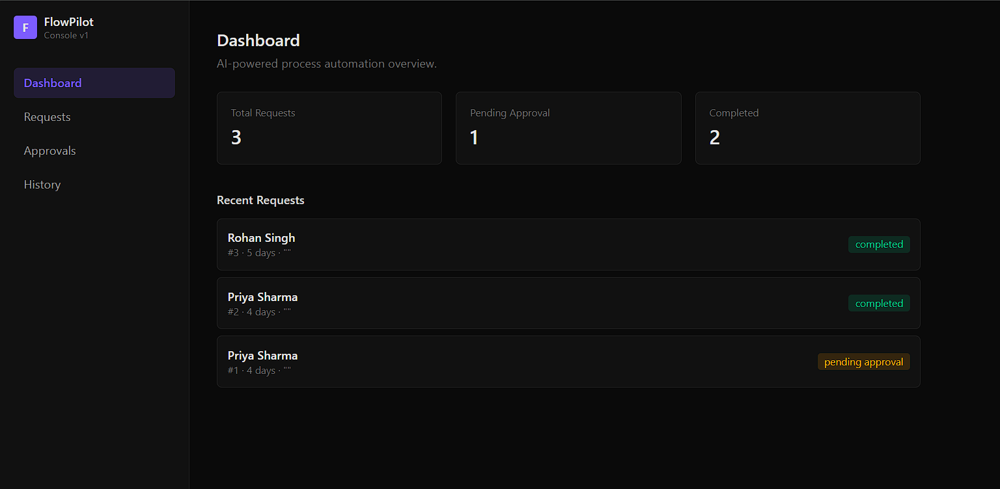
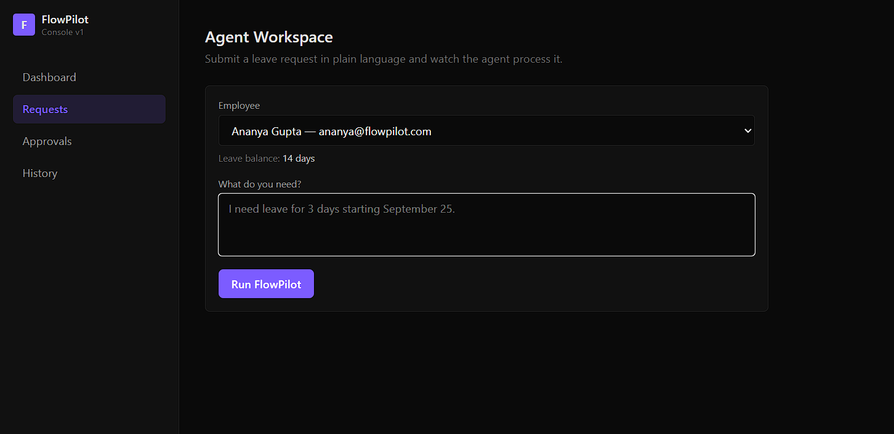
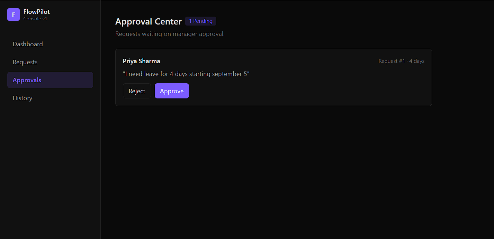
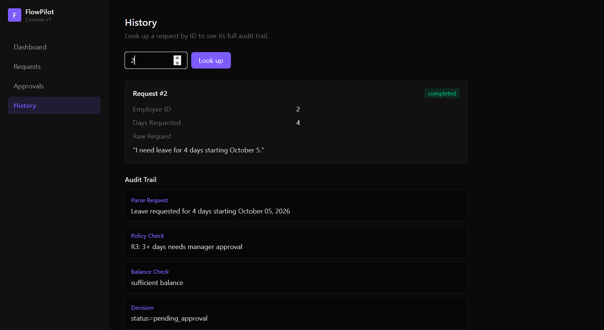

# FlowPilot 🚀
**Agentic Enterprise Process Automation**

FlowPilot converts plain-English employee requests into fully executed, policy-checked, human-approved workflows — with a complete audit trail of what the agent did and why.

**Live demo:** [flow-pilot-mu.vercel.app](https://flow-pilot-mu.vercel.app/)

## Demo Video

[]()

*(Click the image above or [watch the demo here](https://www.youtube.com/watch?v=VffwLg2BDxo))*

## Screenshots

| Agent Workspace | Approval Center |
|---|---|
|  |  |

| Dashboard | History / Audit Trail |
|---|---|
|  |  |

---

## The Problem

Internal requests — leave, access, expenses — usually mean manually checking policy, checking balances/limits, routing to the right approver, and tracking what happened. FlowPilot automates that entire pipeline while keeping a human in the loop wherever judgment or authority is required.

## What It Does

An employee types a request like:
> "I need leave for 3 days starting September 25."

FlowPilot's agent then:
1. **Parses** the request using an LLM (Gemini) to extract structured intent
2. **Checks policy** — applies company leave rules to decide if approval is required
3. **Checks balance** — validates against the employee's actual leave balance
4. **Routes for human approval** when policy requires it, or auto-executes when it doesn't
5. **Pauses** until a manager approves or rejects
6. **Executes the action** — updates the employee's balance and marks the request complete
7. **Logs every step** to an immutable audit trail, visible in the UI

This is the core pattern the project demonstrates:
> **User → Agent → Policy Reasoning → Planning → Human Approval → Tool Execution → Audit**
> — not just `User → LLM → Answer`.

## Current Scope (MVP)

The **Leave Management** workflow is fully implemented end-to-end. Access Management and Expense Management follow the same architecture and are the natural next workflows to add — the pipeline (parse → policy → balance/risk check → approval → execution → audit) is designed to generalize to them without a redesign.

## Tech Stack

| Layer | Technology |
|---|---|
| Frontend | React + TypeScript + Tailwind CSS |
| Backend | FastAPI (Python) |
| Agent / LLM | Gemini API (`google-genai`), with a fake-LLM fallback for offline/rate-limited testing |
| Database | PostgreSQL (SQLite for local development) |
| Deployment | Vercel (frontend) + Render (backend + Postgres) |

## Architecture

```
Employee (React UI)
      ↓
FastAPI /requests/leave
      ↓
Agent: parse (Gemini) → policy check → balance check
      ↓
   ┌──────────────┴──────────────┐
   │                              │
auto-approved                needs approval
   │                              │
   ↓                              ↓
execute action              Approval Center (manager)
   ↓                              ↓
audit log                   approve/reject → execute → audit log
```

## Key Design Decisions

- **LLM-agnostic agent interface** — the parsing step calls a generic `.complete(prompt)` method, so the LLM provider (Gemini, OpenAI, a rules-based fallback) can be swapped with a one-line change. This also means the system degrades gracefully if the LLM API is rate-limited or unavailable.
- **Simulated pause/resume** — the human-approval step is implemented as a status field (`pending_approval`) rather than true LangGraph checkpoint persistence. Functionally and visually identical to the target architecture; the real LangGraph `interrupt()`/checkpointer swap is a known, scoped next step.
- **Everything mocked, nothing fragile** — all "HR/IT/Finance system" actions are internal DB updates, not live third-party integrations. This keeps the system fully demoable without depending on external credentials or APIs that could fail unpredictably.

## Running Locally

**Backend:**
```bash
cd backend
python -m venv venv
source venv/bin/activate  # or venv\Scripts\activate on Windows
pip install -r requirements.txt
# create .env with DATABASE_URL and GEMINI_API_KEY
uvicorn app.main:app --reload
```

**Frontend:**
```bash
cd frontend
npm install
npm run dev
```

## API Endpoints

| Method | Endpoint | Purpose |
|---|---|---|
| POST | `/requests/leave` | Submit a leave request; runs the agent pipeline |
| GET | `/requests/{id}` | Get request details + full audit trail |
| GET | `/dashboard` | Summary counts + recent requests |
| GET | `/approvals` | List pending approvals |
| POST | `/approvals/{id}` | Manager approve/reject decision |

## Roadmap

- [ ] Access Management workflow
- [ ] Expense Management workflow
- [ ] True LangGraph stateful pause/resume with checkpointing
- [ ] RAG over a larger policy knowledge base (ChromaDB)
- [ ] Role-based auth for employees vs. managers

---

Built as a submission for AIONOS's Agentic AI Factory program.